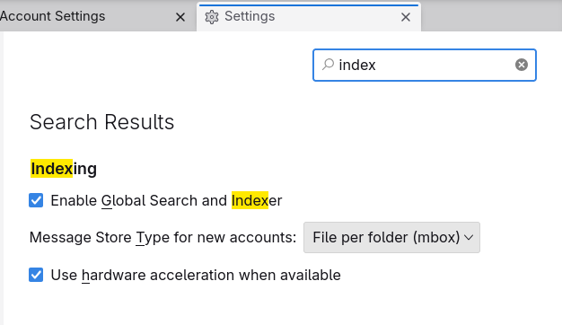
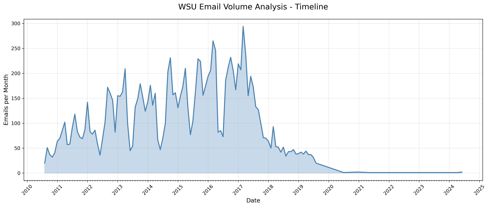
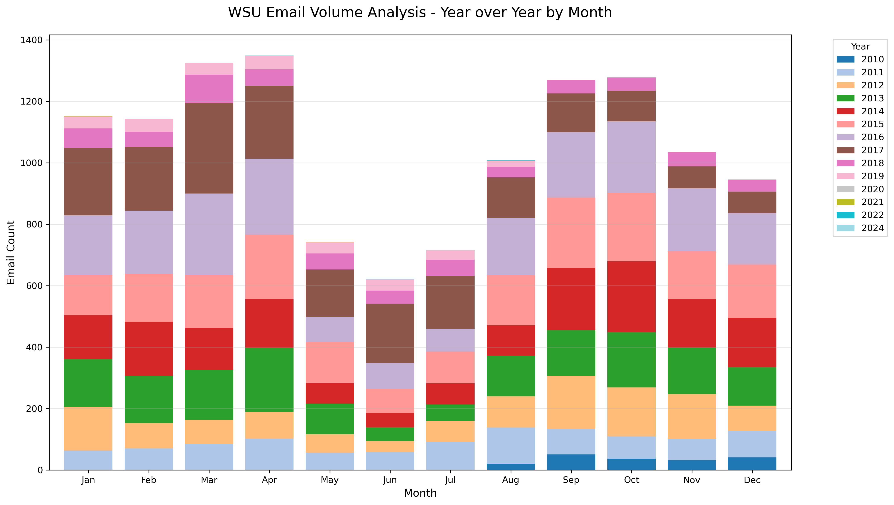
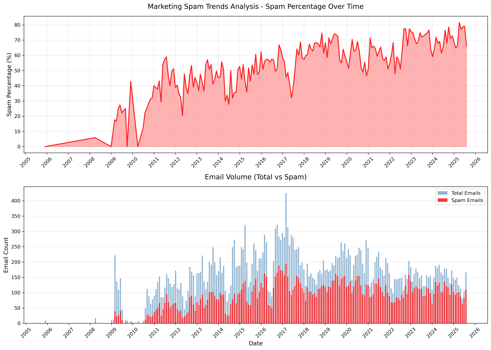
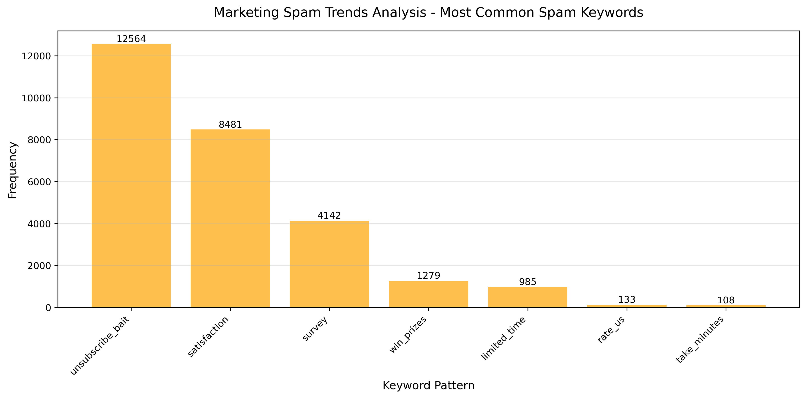
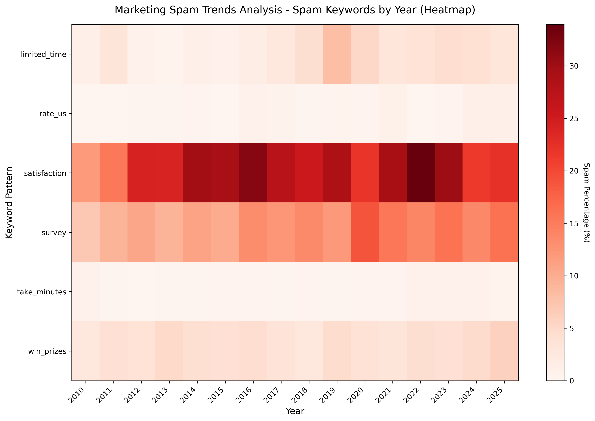

# thunder-muscle

Fast Thunderbird email dataset extraction and analysis using Gloda database.

## Setup

### Dependencies
```bash
# With virtual environment (recommended)
python3 -m venv venv
source venv/bin/activate
pip install -r requirements.txt

# Or system-wide
pip install -r requirements.txt
```

### Thunderbird Profile
1. You must ensure your Thunderbird profile is indexed.
   

2. Copy Thunderbird's profile folder (e.g. `~/.thunderbird/abc123d.default-release`) to a location of your choice
   ``` bash
   cp ~/.thunderbird/*.default-release assets/
   ```
   If you want to run directly on the in-situ profile on your computer, you must close Thunderbird.

3. (Optional) Configure `config.yaml` with your profile name and preferences (see `config.example.yaml`)

## Usage

The main script to export the thunderbird profile as a dataset is `tm.py`, which also functions
as the API layer for other scripts.

### Data API (`tm.py`)
```bash
# Extract complete dataset
python3 tm.py extract [--output data/tb-profile.json]

# Filter emails by criteria
python3 tm.py filter tb-profile.json output.json --domain "*.edu" --year 2023

# Query by content pattern  
python3 tm.py query tb-profile.json output.json --pattern "unsubscribe"

# Show dataset statistics
python3 tm.py stats tb-profile.json
```

### Domain Analysis [`analyze_domains.py`]
```bash
# Analyze domains producing emails with specific patterns
python3 analyze_domains.py dataset.json compare_domain --pattern "unsubscribe"
```

## Output Formats

All commands support `--format json|csv|yaml`. Default format configured in `config.yaml`.

## Performance

Since the tool uses direct "Gloda" (**Glo**bal **Da**tabase) access, the JSON extraction takes roughly 2 seconds to extract 35K emails on a 2015 netbook.

## Workflows [ `workflows/` ]

**thunder-muscle** uses YAML workflows to define multi-step analysis pipelines. The workflow runner automatically discovers and executes tools from the `analyzers/`, `plotters/`, and `tools/` directories, making it easy to chain data extraction, filtering, analysis, and visualization into reproducible pipelines.

```bash
# Run any workflow
python3 lib/workflow.py workflows/spam_analysis.yaml
# or
./workflow workflows/wsu_analysis.yaml  # convenience wrapper
```

I'm not intentionally a data hoarder, I'm just not an aggressive email deleter and filter user. 
This has changed some in recent years, as the techniques for spam emails have evolved to covertly trojan "survey" subterfuge into your mailbox. Surveys are marketing emails, and a quick analysis on my email history (minimal deletions) has shown that my hunch on survey spam is mostly correct. Around 2023, I began marking all surveys as spam.

Much of this can be done in a Jupyter notebook--far easier to refresh plots this way--although `:MarkdownPreview` in **Neovim** is quite good. I'm not against notebooks. They are far more friendly than this model. 

I developed this method in my Markdown-to-PDF project--**[oshea](https://github.com/brege/oshea)**--where I realized comprehensive end-to-end tests were just manifest workflows. It's an intuitive way to string command line sequences together. The *pipeline* term in machine learning/data science is congruent to this system.

```bash
docs/img/ # <- output/plots/ <- workflows/
├── spam
│   ├── spam_heatmap.png
│   ├── spam_keywords.png
│   └── spam_timeline.png
└── wsu
    ├── timeline.png
    └── year_over_year_histogram.png
```

#### Grad-school Emails

The monthly timeline reveals the academic year rhythm: high volume during active semesters with dramatic drops during summer breaks and winter holidays. The 2016-2017 dip corresponds to dissertation defense period, where militant email sanitation was a reprieve from LaTeX and simulation monitoring--hence the dip.

My personal dataset has about 35K emails between my grad-school emails and [my current website's](https://brege.org) personal email. Not included are my Gmail and undergrad email(s). I plan on synchronizing those at a later date.

- **[`workflows/wsu_analysis.yaml`](workflows/wsu_analysis.yaml)**
- **[`plot_temporal.py`](plotters/plot_temporal.py)**
- **[`analyze_temporal.py`](analyzers/analyze_temporal.py)**



WSU's Okta system requires(d) changing passwords every 6 months, and sometime a couple years after my defense my account died. I am thankful that I had a thunderbird profile tucked away on a drive that allowed me to recover all of my university emails..



The year-over-year histogram demonstrates consistent academic seasonality, with September-April peaks and May -- mid-August valleys across all years of graduate study.  Even with teaching summer labs, the beuracratic pressure in the summertime dies. I loved teaching in the summer.

#### Spam Emails

- **[`workflows/spam_analysis.yaml`](workflows/spam_analysis.yaml)**
- **[`plot_spam_trends.py`](plotters/plot_spam_trends.py)**
- **[`analyze_spam_keywords.py`](analyzers/analyze_spam_keywords.py)**

The spam timeline shows minimal marketing emails pre-2010, followed by a sharp increase around university enrollment. By 2015, spam reached 60-80% of all emails and has remained consistently high. The GDPR implementation around 2018 created a spike in `unsubscribe` language as companies scrambled to comply with new regulations.



The tail in the beginning of this timeline is presented for context.
It only includes a "purified" hotmail account mailbox from my teenage years that extended a bit into my undergrad years. Those years overlap with gmail usage (not integrated into this data) and my GVSU university email.




Another useful filter for spam emails is checking for keywords like **`unsubscribe`** in the message body.

`unsubscribe_bait` dominates with over 12,500 matches, followed by `satisfaction` surveys (~8k) and direct "survey" requests (~4k). This reveals how modern marketing shifted from direct sales to engagement-focused tactics requesting feedback and reviews.



The heatmap (filtered to post-2010) shows "satisfaction" spam as the most persistent threat, maintaining 20-25% frequency from 2012 onwards. Survey-based spam shows steady growth, intensifying after 2020, when both GDPR constraints pressured companies to invent new angles of attack, becoming increasingly desperate for customer "feedback" (attention) during the pandemic. **Satisfaction feedback surveys are advertisements.**

## License

[GPLv3](https://www.gnu.org/licenses/gpl-3.0.en.html)
